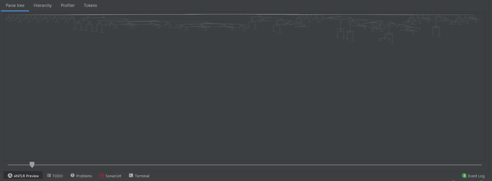

# sigma_people_parser
Team members: Daniel Buffum, Jaden Hawley, Greg Ryterski, Jamal Saied, Xin Zhang

This project implements a parser for the Python language, using Context-free Grammar (CFG) with ANTLR, a powerful parser generator for reading, processing, executing, or translating structured text or binary files. The parser implements the following features: if/else blocks, variable definitions, while and for loops, arithmetic operators (+, -, *, /, %, ^), assignment operators (=, +=, -=, *=, /=, ^=, %=), conditional statements (<, <=, >, >=, ==, !=, and, or, not), support for comments.

### Requirements:
- ANTLR 4.9.3 runtime for Python
- Virtual environment
- (Optional) IntelliJ for visualization of parse tree

### How to Run Parser:
1. Clone repo `git clone https://github.com/jsaied99/sigma_people_parser.git`
2. Create a virtual environment `virtualenv env`
3. Activate virtual environment `source env/bin/activate`
4. Install ANTLR 4.9.3 for Python `pip install -r requirements.txt`
5. Run `python3 pythonParser.py python_testcode.py` to output parse tree for python_testcode.py

### Demo Video:
https://youtu.be/HcWkY04jDjQ
